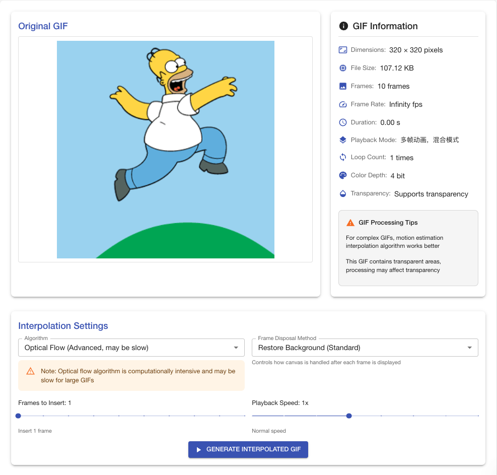

# GIF Frame Interpolator

A GIF frame interpolation tool built with React and Material UI, using advanced image interpolation algorithms to make GIF animations smoother.



## Features

- 🖼️ Upload and process any GIF file
- 🧠 Support for multiple interpolation algorithms:
  - Linear Interpolation (Fast) - Simple blending between frames
  - Weighted Interpolation (Balanced) - Improved blending with position weighting
  - Bilinear Interpolation (Smooth) - Smoother transitions with 2D interpolation
  - Motion Estimation (Better) - Detects motion between frames for better results
  - Optical Flow (Advanced) - Highest quality but computationally intensive
- ⚙️ Adjustable number of frames to insert (1-10 frames)
- 🎛️ Playback speed control and disposal method settings
- 📊 Comprehensive metadata display for both original and processed GIFs:
  - Dimensions, file size, frame count
  - Frame rate and duration
  - Transparency detection
  - Loop count and playback mode
  - Color depth information
- 🔄 Real-time processing preview
- 📱 Responsive design, supports mobile devices

## Live Demo

Visit [GIF Interpolate](https://Zhipingyang.github.io/GifInterpolate) to experience the online version.

## Installation and Setup

### Prerequisites

- Node.js (v14.0 or higher)
- npm or yarn

### Clone the Repository

```bash
git clone https://github.com/ZhipingYang/GifInterpolate.git
cd GifInterpolate
```

### Install Dependencies

Using npm:

```bash
npm install
```

Or using yarn:

```bash
yarn
```

### Key Dependencies

The project uses the following key dependencies:

- React and React DOM
- TypeScript
- Material UI (@mui/material, @mui/icons-material)
- gif.js (GIF encoding library)
- gifuct-js (GIF parsing library)

### Run Development Server

```bash
# Local development (recommended)
npm run start:local
# or
yarn start:local

# Standard start
npm start
# or
yarn start
```

The application will run in development mode. Access it at [http://localhost:3000](http://localhost:3000).

## Deploy to GitHub Pages

### Install gh-pages Package

```bash
npm install --save-dev gh-pages cross-env
# or
yarn add --dev gh-pages cross-env
```

### package.json Configuration Notes

This project has configured the following scripts for different scenarios:

- `start:local`: Use empty PUBLIC_URL for local development (recommended)
- `start`: Standard startup script
- `deploy`: Automatically build and deploy to GitHub Pages

Note: Use `homepage: "."` for development and `homepage: "https://ZhipingYang.github.io/GifInterpolate"` for deployment.

### Deploy the Application

```bash
npm run deploy
# or
yarn deploy
```

This will build the application and deploy it to GitHub Pages.

## Usage Instructions

1. Click or drag to upload a GIF file
2. Select the interpolation algorithm and the number of frames to insert
3. Adjust playback speed and frame disposal method if needed
4. Click the "Generate Interpolated GIF" button
5. After processing, you can view detailed metadata and download the interpolated GIF

## Technical Implementation

The application uses several techniques to handle GIF processing:

- Frame extraction and analysis using gifuct-js
- Canvas-based frame manipulation for transparency support
- Multiple interpolation algorithms with increasing complexity and quality
- Efficient memory management for large GIFs
- Progressive rendering for real-time preview

## Notes

- Large GIFs or advanced algorithms (like optical flow) may require longer processing time
- The processing will consume significant memory, especially for large-sized GIFs
- For complex GIFs, motion estimation or optical flow interpolation is recommended for better results
- Transparent GIFs are supported but may have varying results depending on the algorithm

## License

MIT License - See the [LICENSE](LICENSE) file for details

## Contributing

Issues and Pull Requests are welcome!
